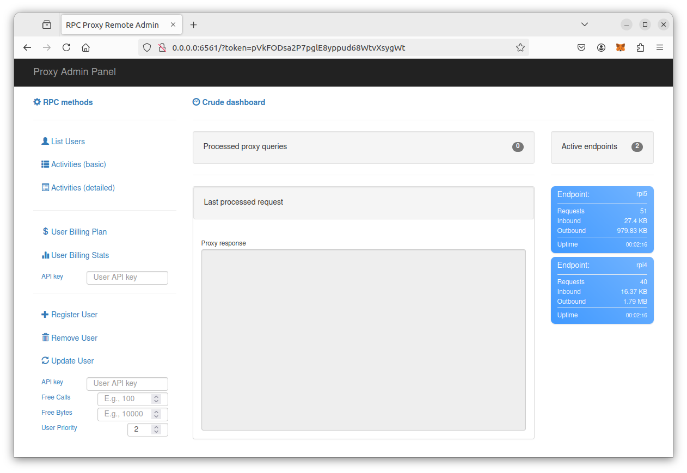
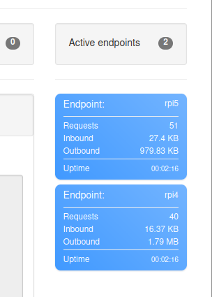
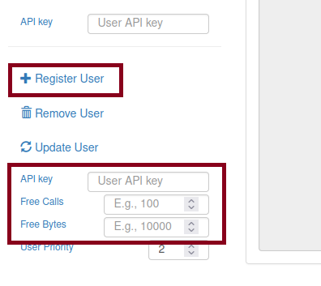
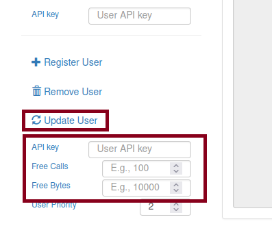
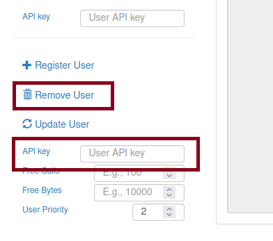
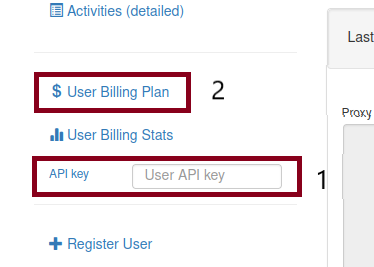
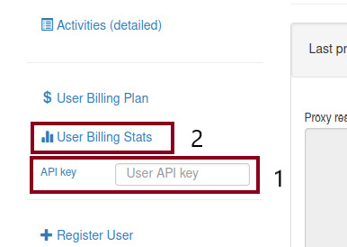

When the proxy is started, the access url to the admin panel is generated.
Check logs and grep the line that looks like this
```
Access admin portal with:
http://0.0.0.0:6561/?token=DJQPiFYBAks9n2vedLIXLtvUu3kuTe60
```
Update the address part `0.0.0.0` in the url according to your network configuration if necessary.
Note that the access token may change in the next run of the proxy. There is just one page.



## Nodes stats

Admin panel provides simple usage stats on connected Ethereum nodes.



## Users

Users are managed with Admin Panel. Each user is identified by its API key.
API key are case sensitive.
It can be set the limit for calls and transferred bytes for each user. 
In order to authorize a user in a RPC call, add API key to the path like

```text
http(s)://<web3pi-proxy-domain>:<web3pi-proxy-port>/<API-key>
```

for instance

```text
http://localhost:6512/abcdef
```

where the proxy is run on `localhost` on the port `6512` and a user's API key is `abcdef`.

### Create a new user

Note that users need to have distinct API keys. 

Provice API key, a limit for calls (`Free Calls`) and a limit for transferred bytes (`Free Bytes`).
Then press `Register User`.



**WARNING** Due to a bug, when API key is provided, do not hit `Enter` key, but press a button. 
When the error page is received, simply go back to a previous page.
Will be fixed soon, sorry for inconvenience.
This is valid for this and below actions.

### Update a user configuration

Provice existing API key - i.e. a user must exist.
Provide a new limit for calls (`Free Calls`) and a new limit for transferred bytes (`Free Bytes`).
Then press `Update User`.



### Remove a user

Provice existing API key - i.e. a user must exist.
Then press `Remove User`.



### A user configuration

Provice existing API key.
There are two `API key` fields, be sure to pick the right one.
Then press `User Billing Plan`.
The response is shown in the text area on right.



### A user stats

Provice existing API key.
Then press `User Billing Stats`.
The response is shown in the text area on right.



## Billing

The functionality is under construction.
