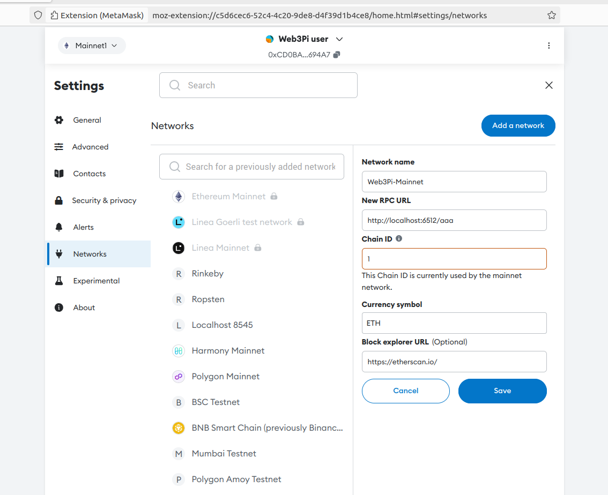
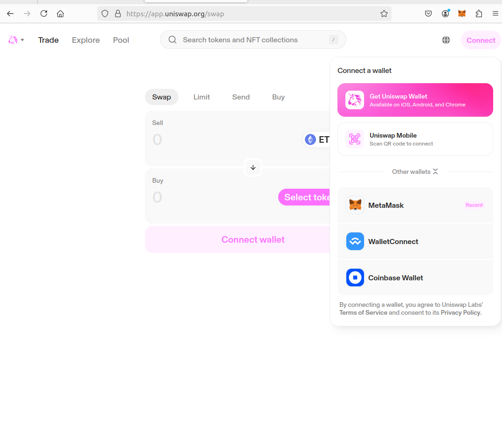
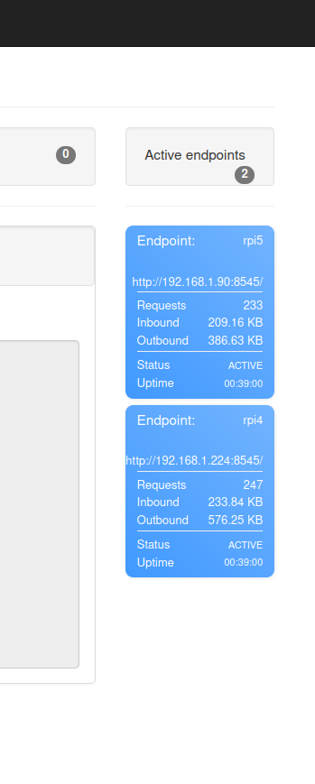

Any client can connet RPC Reverse Proxy. A web client, scripting tools, 
backend servers etc. 
It is the same as with other Ethereum RPC providers: you need to use a user's access URL.
Recall that it has the form like

```text
http(s)://<web3pi-proxy-domain>:<web3pi-proxy-port>/<API-key>
```

for instance

```text
http://localhost:6512/abcdef
```

where the proxy is run on `localhost` on the port `6512` and a user's API key is `abcdef`.

In particular one can integrate a wallet. The remaining section refers to this matter. 

## Example

We present an example where Metamask is integrated. Other wallets should work as well in a similar way. 
A new Mainnet network is created here, so you end up having two Mainnet networks.

1. Prepare the access URL.
2. Open Browser and open Metamask.
3. Open Settings and click Add a network.
4. Provide appropriate data. Note New RPC URL input, this is a crucial part, and enter the access URL. Recall that the access URL contains the proxy address and API key.

{width=75%}

Now you can connect an application to the wallet in the usual way. Make sure the wallet is switched to the correct network.

### Testing

In order to verify the configuration, use any dapp. Here we use Uniswap, feel free to test other apps.
Note that Metamast makes some calls by its own.

1. Switch the wallet to the right network.
2. Open the dapp webpage.
3. Connect the wallet in a regular way.  
{width=50%}
4. Use dapp. No need to perform a swap actually.
5. Check the stats at Admin Panel. See the traffic stats increase.

{width=25%}

